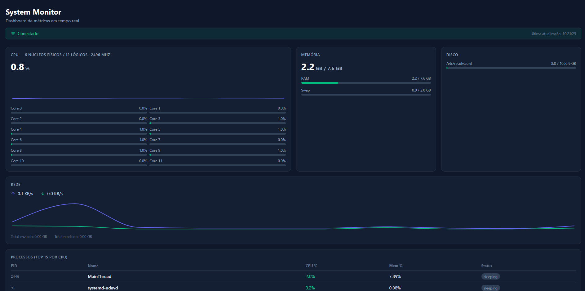

# 🖥️ System Monitor Dashboard

A real-time system monitoring dashboard built with a Python backend and Next.js frontend, communicating via WebSockets.




## 🌐 Live Demo

**[system-monitor-ochre.vercel.app](https://system-monitor-ochre.vercel.app/)**

## 🚀 Features

- **CPU** — overall usage, per-core breakdown and historical line chart
- **Memory** — RAM and Swap with dynamic progress bars
- **Disk** — usage per partition
- **Network** — real-time upload/download speed
- **Processes** — top 15 processes sorted by CPU usage
- **WebSocket** — automatic updates every 2 seconds
- **Auto-reconnect** — recovers connection without page reload

## 🛠️ Tech Stack

| Layer | Technology |
|---|---|
| Frontend | Next.js 16, TypeScript, Tailwind CSS, Recharts |
| Backend | Python 3.12, FastAPI, WebSockets, psutil |
| Infrastructure | Docker, Docker Compose, Vercel, Render |

## 📁 Project Structure

├── backend/
│   ├── main.py          # API REST + WebSocket
│   ├── metrics.py       # Coleta de métricas do sistema
│   ├── requirements.txt
│   └── Dockerfile
├── frontend/
│   ├── app/
│   ├── components/      # CPUPanel, MemoryPanel, NetworkPanel...
│   ├── hooks/           # useSystemMetrics (WebSocket)
│   ├── types/           # TypeScript interfaces
│   └── Dockerfile
└── docker-compose.yml##

## ⚡ Running Locally

### With Docker (recommended)

```bash
git clone https://github.com/joagomes/system-monitor
cd system-monitor
docker compose up --build
```

Open `http://localhost:3000`

### Without Docker

**Backend:**
```bash
cd backend
python3 -m venv venv
source venv/bin/activate
pip install -r requirements.txt
uvicorn main:app --reload --host 0.0.0.0 --port 8000
```

**Frontend:**
```bash
cd frontend
npm install
npm run dev
```

## 🔌 API Reference

| Endpoint | Método | Descrição |
|---|---|---|
| `/` | GET | Info da API |
| `/health` | GET | Health check |
| `/api/metrics` | GET | Snapshot das métricas |
| `/ws` | WebSocket | Stream em tempo real |

## 💡 What I Learned

- Real-time client-server communication using WebSockets
- Async FastAPI with multiple simultaneous connection management
- Next.js App Router with TypeScript and custom hooks
- Docker multi-stage builds for optimized production images
- Docker Compose for multi-service orchestration
- Independent frontend/backend deployment with automatic CI/CD

## 👤 Author

**João Gomes** — [GitHub](https://github.com/JoaoGomesDev32) · [LinkedIn](https://www.linkedin.com/in/joaofelipedev32/)

> Built as part of my developer portfolio. Student at 42Lisboa.
